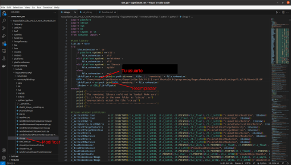
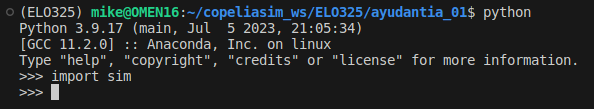
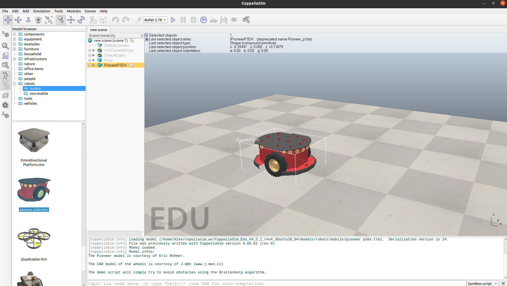
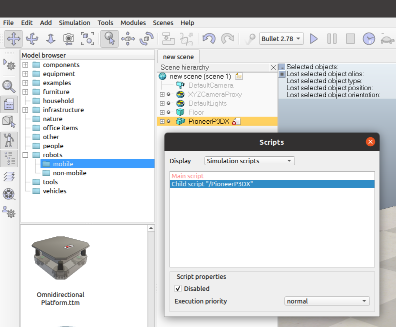
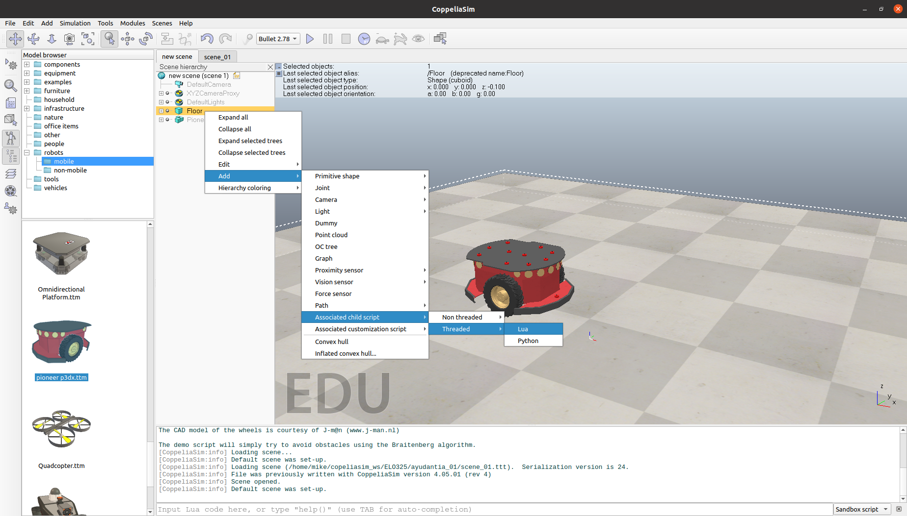
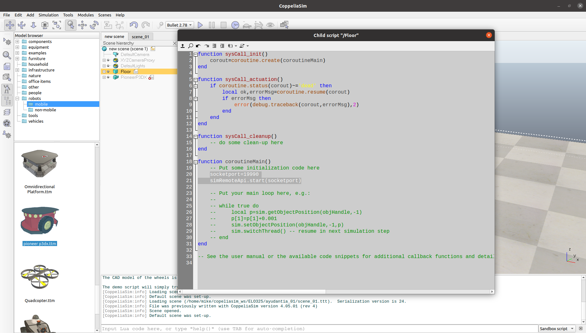
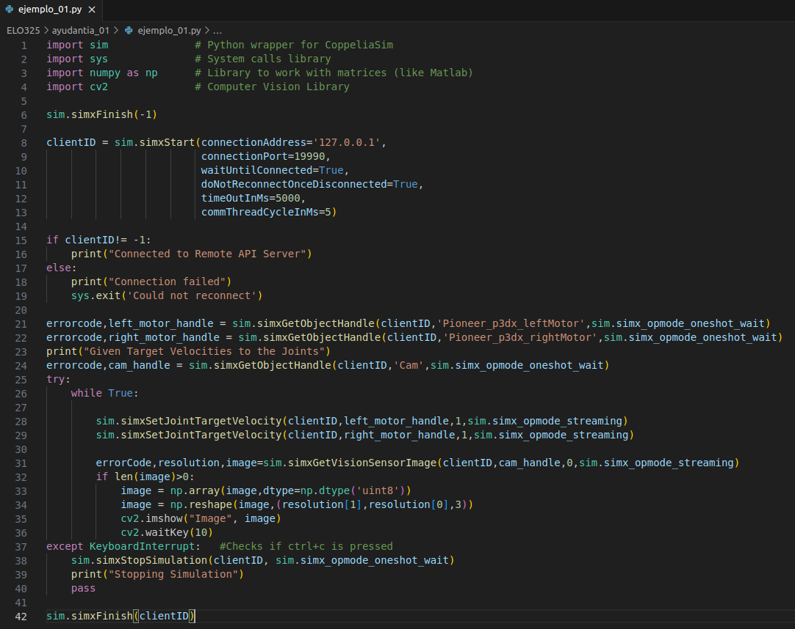

<!-- Referencia python -->
<!-- https://blog.sravjti.in/2021/06/26/using-python-api-in-coppeliasim.html -->

## Links utiles
[CoppeliaSim API](https://www.coppeliarobotics.com/helpFiles/en/apiFunctions.htm)

## Prerequisitos
### Opción A
1. Miniconda ([link](https://docs.conda.io/en/latest/miniconda.html))

2. Descargar CoppeliaSim ([link](https://www.coppeliarobotics.com/downloads))
3. Visual Studio Code (Opcional) ([link](https://code.visualstudio.com/download))

# Instalación en Ubuntu 20.04
## Crear ambiente de python
```
conda create -n ELO325
conda activate ELO325
conda install -c conda-forge opencv
```
## Configuración de Coppeliasim + Python 3
1. Para mantener organizado el espacio de trabajo, crearemos una carpeta donde ubicaremos el programa CoppeliaSim y los ejemplos.
 	```
    mkdir ~/coppeliasim_ws
    ``` 
2. Una vez ubicado CoppeliaSim en nuestro espacio de trabajo, debemos indicarle a python donde debe buscar las librerias de CoppeliaSim. En este caso, las librerias de python se encuentran ubicadas en: 

    `${HOME}/copeliasim_ws/CoppeliaSim_Edu_V4_5_1_rev4_Ubuntu20_04/programming/legacyRemoteApi/remoteApiBindings/python/python`

3. Habiendo confirmado la ubicación, agregamos una nueva ruta a PYTHONPATH, para esto agregamos al final del archivo `~/.bashrc`
    ```
    export PYTHONPATH="${HOME}/copeliasim_ws/CoppeliaSim_Edu_V4_5_1_rev4_Ubuntu20_04/programming/legacyRemoteApi/remoteApiBindings/python/python"
    ```
4. Para que los cambios surjan efecto, cerramos y abrimos terminal o ejecutamos en el mismo terminal 

    ```
    source ~/.bashrc
    ```

5. Luego, abrimos el archivo `sim.py` ubicado en la misma direccion y modificamos la siguiente linea con la dirección del archivo `remoteApi.so` ubicado en:

    `/home/<USER>/copeliasim_ws/CoppeliaSim_Edu_V4_5_1_rev4_Ubuntu20_04/programming/legacyRemoteApi/remoteApiBindings/lib/lib/Ubuntu20_04`

    

6. Ahora, python debería ser capaz de importar la libreria de CoppeliaSim. Para comprobar, abrimos un terminal y ejecutamos:
    
    

## Comunicación CoppeliaSim y Python

1. Abrimos un terminal y ejecutamos el siguiente archivo shell:

    

2. Dentro de la interfaz gráfica, nos dirigimos a [Model browser -> robots -> mobile] y en la ventana inferior arrastramos el modelo "pionner p3dx.ttm"

    

3. Deshabilitamos el script que trae el modelo tal como muestra la imagen siguiente:

    

4. Y haciendo click derecho en cualquier otro objeto (en este caso hacemos click derecho en el objeto Floor), generamos un script de Lua tal como muestra la imagen:

    

5. Abrimos el script y colocamos las dos lineas marcadas como muestra la imagen siguiente:

    

6. Cerramos la ventana del script, y procedemos a crear un archivo de python

    

7. Ejecutamos el simulador y luego corremos el codigo de python

    <video src='img/vid_01.mp4' width=900/>
# Instalación Windows

## Configuración de Coppeliasim + Matlab

    
